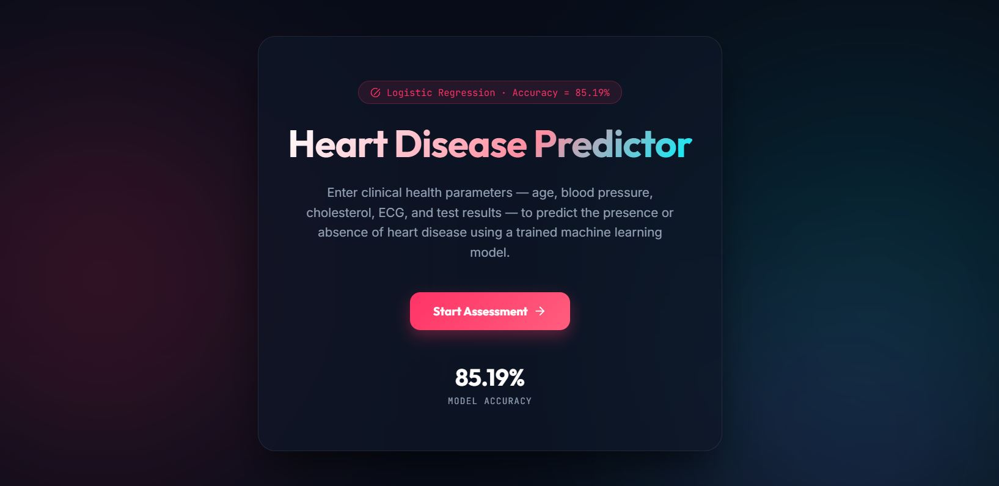
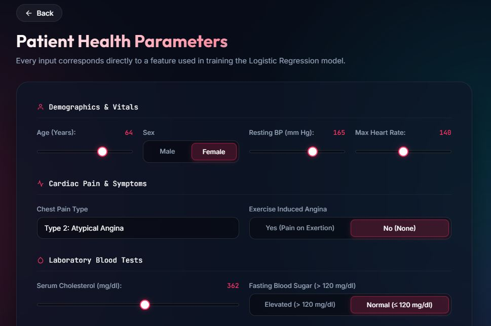
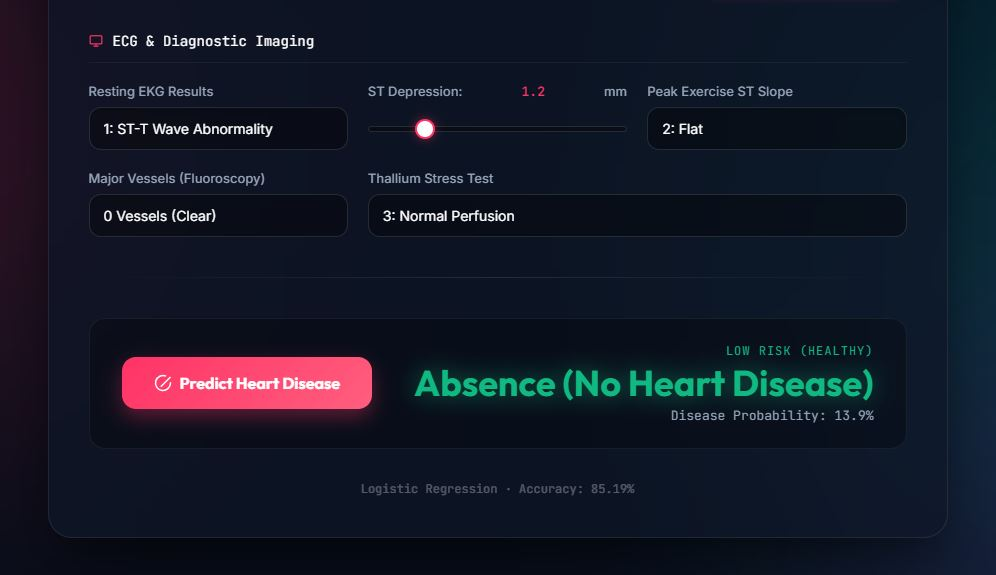

# ❤️ Heart Disease Predictor

**🔗 Live Demo:** [**heart-patient-prediction.netlify.app**](https://heart-patient-prediction.netlify.app/)


A Binary Logistic Regression model that predicts the presence or absence of heart disease based on clinical patient health metrics, paired with a clean, interactive web UI that lets clinicians and users assess cardiovascular risk — no backend required.

Trained end-to-end on a real-world dataset of 270 patient records covering 13 clinical diagnostic features, using scikit-learn.

## ✨ Features

- **Full-spectrum diagnostic assessment** — every key clinical metric (Age, Sex, Chest Pain Type, Resting BP, Serum Cholesterol, Fasting Blood Sugar, Resting ECG, Max Heart Rate, Exercise Induced Angina, ST Depression, Peak ST Slope, Fluoroscopy Vessels, Thallium Stress Test) is a live, configurable input field
- **Standardized clinical ranges** — sliders, toggle switches, and categorical dropdowns are calibrated to medically accurate thresholds with real-time value badges
- **Instant, backend-free prediction** — the trained Logistic Regression model coefficients, intercept, and standard scaler mean/scale vectors are embedded directly in the frontend JavaScript, calculating sigmoid probability client-side with zero latency and zero API calls
- **Two-screen flow** — an introduction landing page highlighting model performance, followed by a structured diagnostic assessment form with instant presence/absence classification and risk probability scores

## 📸 Screenshots

**Landing screen**



**Assessment & Prediction screens**

<p align="center">
  
  
</p>

## 🧠 Model

| | |
|---|---|
| Algorithm | scikit-learn `LogisticRegression` |
| Preprocessing | `StandardScaler` (Z-score normalization) |
| Features (13) | `Age`, `Sex`, `Chest pain type`, `BP`, `Cholesterol`, `FBS over 120`, `EKG results`, `Max HR`, `Exercise angina`, `ST depression`, `Slope of ST`, `Number of vessels fluro`, `Thallium` |
| Target Variable | `Heart Disease` (Absence = 0, Presence = 1) |
| Train/test split | 80/20 (Stratified) |
| **Model Accuracy** | **85.19%** |

Full training pipeline — data exploration, label encoding, standard scaling, train/test split, logistic regression fitting, and accuracy evaluation — is documented in [`training.ipynb`](training.ipynb).

## 🛠️ Tech stack

- **Model**: Python, pandas, numpy, scikit-learn
- **Frontend**: HTML, Vanilla CSS, Vanilla JavaScript (no framework, no build step, runs 100% in browser)

## 📁 Project structure

```
Heart_Disease_Prediction_Logistic_Regression_2classes/
├── README.md
├── training.ipynb          Model training notebook
├── heart.csv               Dataset used for training
├── screenshots/            App screenshots used in this README
│   ├── 1.JPG
│   ├── 2.JPG
│   └── 3.JPG
└── app/
    ├── index.html          Diagnostic UI markup
    ├── style.css           Glassmorphic styling & theme
    └── script.js           Embedded model weights + prediction engine
```

## 🚀 Running the app

No installation needed — it's a static site.

1. Clone or download this repo
2. Open `app/index.html` directly in your browser

or serve the `app/` folder with any static host (GitHub Pages, Netlify, Vercel) for a shareable link.

## 📓 Running the notebook

```bash
pip install pandas numpy scikit-learn
jupyter notebook training.ipynb
```

Make sure `heart.csv` stays in the same folder as the notebook.

## 📄 License

This project is open source and available for personal and educational use.
