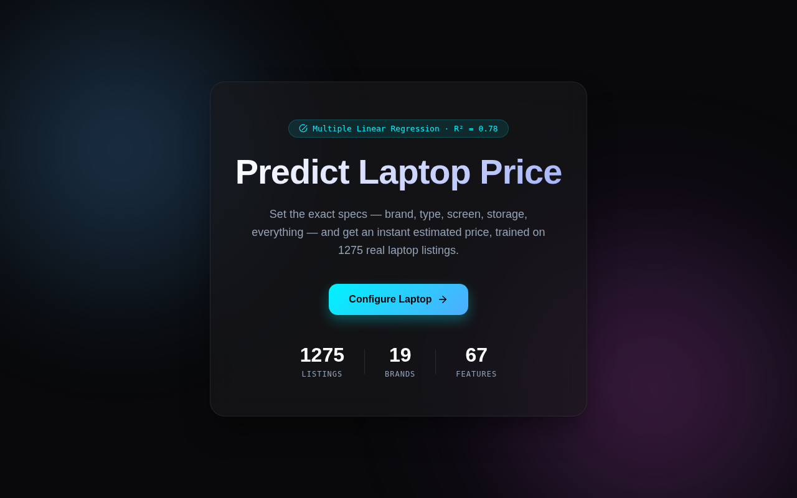
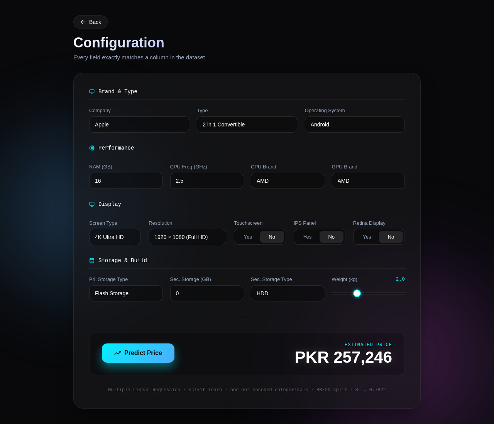

# 💻 Laptop Price Predictor

**🔗 Live demo: [predict-laptop-price.netlify.app](https://predict-laptop-price.netlify.app/)**

A Multiple Linear Regression model that predicts laptop prices (in PKR), paired with a clean, interactive web UI that lets anyone configure a laptop's specs and get an instant price estimate — no backend required.

Trained end-to-end on a real-world dataset of 1275 laptop listings covering 19 brands, using scikit-learn.

## ✨ Features

- **Full-spec prediction** — every meaningful column in the dataset (brand, type, OS, RAM, CPU, GPU, display, storage, weight) is a live input field
- **Realistic inputs only** — dropdowns are built from the actual discrete values in the dataset (e.g. RAM only offers 2/4/6/8/12/16/24/32/64 GB — no impossible specs like "20GB RAM")
- **Instant, backend-free prediction** — the trained model's coefficients are embedded directly in the frontend, so price updates happen client-side with zero API calls
- **Two-screen flow** — a landing page introduces the model, then a full configuration screen collects every spec before predicting

## 📸 Screenshots

**Landing screen**



**Configuration screen**



## 🧠 Model

| | |
|---|---|
| Algorithm | scikit-learn `LinearRegression(Multiple)` |
| Features | Ram, Weight, ScreenW, ScreenH, CPU_freq, SecondaryStorage + one-hot encoded Company, TypeName, OS, Screen, Touchscreen, IPSpanel, RetinaDisplay, CPU_company, PrimaryStorageType, SecondaryStorageType, GPU_company |
| Train/test split | 80/20 |
| **R² score** | **0.78** |

Full training pipeline — data cleaning, EUR→PKR conversion, one-hot encoding, train/test split, and evaluation — is documented in [`training.ipynb`](Laptop_Price_Prediction_Linear_Regression/training.ipynb).

## 🛠️ Tech stack

- **Model**: Python, pandas, scikit-learn
- **Frontend**: HTML, CSS, vanilla JavaScript (no framework, no build step)

## 📁 Project structure

```text
ML_Projects/
├── README.md
└── Laptop_Price_Prediction_Linear_Regression/
    ├── training.ipynb
    ├── laptop_price.csv
    ├── screenshots/
    │   ├── landing.png
    │   └── form.png
    └── app/
        ├── index.html
        ├── style.css
        └── script.js
```

## 🚀 Running the app

No installation needed — it's a static site.

1. Clone or download this repo
2. Open `app/index.html` directly in your browser

or serve the `app/` folder with any static host (GitHub Pages, Netlify, Vercel) for a shareable link.

## 📓 Running the notebook

```bash
pip install pandas numpy scikit-learn matplotlib seaborn
jupyter notebook training.ipynb
```

Make sure `laptop_price.csv` stays in the same folder as the notebook.

## 📄 License

This project is open source and available for personal and educational use.
